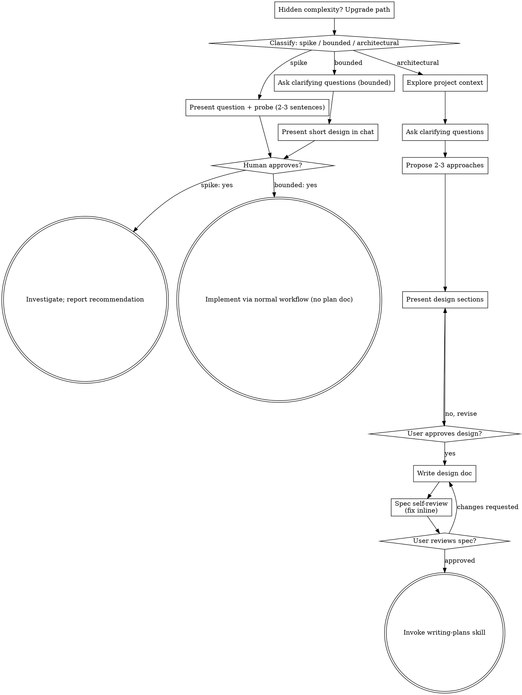

# 把想法头脑风暴成设计（Brainstorming Ideas Into Designs）

通过自然的协作对话，把想法打磨成完整的设计与规格说明。

先从判断该请求需要多少流程入手，然后沿你的路径推进：理解上下文、打磨想法、呈现设计，并获得你的（人类）搭档的批准。

<HARD-GATE>
在你告诉你的（人类）搭档你打算做什么、并且对方批准之前，不得调用任何实现类技能、编写任何代码、搭建任何项目、或采取任何实施动作。该规则适用于下面每条路径上的每一个任务——仪式感随任务规模缩放；批准关卡从不缩放。
</HARD-GATE>

## 三条路径（Three Paths）

在问出第一个问题之前，先对请求进行分类，并大声说出分类结果——例如"这看起来是有界的（bounded），所以我在这里直接给出一份简短设计，而不是写规格说明"——这样你的（人类）搭档才能否决它：

- **探针（Spike）** — 一个可行性问题（"我们能不能……""这可行吗……""快速且粗糙就行"），其产物是一个答案，而不是你要保留的代码。用 2-3 句话说明问题和你打算尝试什么，得到点头后，就以"正确性允许范围内的最低成本"去求证。不写设计文档，不写规格文件。把发现作为建议上报；任何构建出来的东西都标注为一次性（throwaway）。
- **有界（Bounded）** — 对本仓库中已存在的代码进行范围明确的改动：一个新开关（flag）、一个小接口、一个单文件的修复。仅仅知道"这是什么类型的应用"还不够——所谓有界，是指你要改的那条流程已经在这里、可以阅读。如果没有现成的流程可改，该任务就不是有界的。问出真正要紧的澄清问题，在聊天中呈现一份简短设计（几句话到几小段），然后**停止**。只有你的（人类）搭档对该设计说了"好"之后，实施才开始——有界任务的批准关卡和架构级任务一样硬。不写规格文件，不写实施计划文档。
- **架构级（Architectural）** — 新项目、新子系统、重组组件拼接方式或改动他人所依赖接口的变更。走完整流程：提问、方案、分节设计、书面规格说明，然后是 writing-plans 技能。

在两条路径之间拿不准时，选更重的那条。棘轮是单向的：任务中途发现的隐藏复杂度会把路径**升级**——停下来，明说，然后升上去。没有任何东西会在中途降级。

## 反模式："太简单，不需要批准"（Too Simple To Need Approval）

每一条路径都以你的（人类）搭档在实施前批准你的意图作为终点。一张待办清单、一个单函数工具、一次配置改动——设计可能只是聊天里的两句话，但你必须呈现它并取得批准。"简单"的任务恰恰是未经验证的假设造成最多浪费的地方。随简单程度缩放的是交付物（artifact），绝不是批准。

## 危险信号（Red Flags）

| 想法 | 现实 |
|------|------|
| "这太简单了，不需要设计" | 简单意味着简短的设计，而不是没有设计。聊天里两句话，然后批准。 |
| "我把它称为有界，跳过规格说明" | 为了省事而随手抓个标签，本身就是疑虑——走更重的路径。 |
| "它是有界的、设计一目了然——我趁他们读的时候就开工吧" | 关卡是"批准"，不是设计的长度。先呈现，然后停下，直到听到"好"。 |
| "我懂这类应用，所以它是有界的" | Bounded 衡量的是仓库本身，而不是你的熟悉度。新项目没有现成流程——它是架构级的。 |
| "探针成功了，所以我把代码留下" | Spike 的产物是一个答案。留下代码是一个新请求——重新分类它。 |
| "它中途升级了，但我快做完了——没必要重新分类" | 隐藏复杂度会在任务中途把路径升级。停下来并明说。 |
| "他们批准了 spike，所以后续改动也算批准了" | 每个任务都有自己的分类，也有自己的批准。 |

## 检查清单（Checklist）

先分类，宣布路径，然后为你路径上的每个条目创建一个任务，并按顺序完成它们。

**探针（Spike）：**
1. **探索项目上下文** — 足以界定这次探针即可
2. **呈现问题 + 探针计划** — 2-3 句话
3. **取得批准** — 点一下头就够
4. **调查** — 以正确性允许的最低成本进行
5. **汇报发现** — 给出一份建议；任何构建物都标注为一次性（throwaway）

**有界（Bounded）：**
1. **探索项目上下文** — 查看文件、文档、最近的提交
2. **问澄清问题** — 一次一个，问那些真正要紧的
3. **在聊天中呈现简短设计** — 方案、会触及的文件、测试
4. **取得批准** — 停止并等待一个明确的"好"；一边呈现设计一边就开工，等于跳过了关卡
5. **实施** — 按正常开发流程推进（TDD 适用）；不写计划文档

**架构级（Architectural）：**
1. **探索项目上下文** — 查看文件、文档、最近的提交
2. **在恰当时机（just-in-time）提供可视化伴档** — 而不是一上来就提供。第一次出现"用图展示比用文字描述更清楚"的问题时，在那个时点提供它（单独一条消息）；获批后它的浏览器标签页会为你打开。如果从未出现可视化问题，就永远不要提供。参见下方"可视化伴档（Visual Companion）"一节。
3. **问澄清问题** — 一次一个，理解目的/约束/成功标准
4. **提出 2-3 种方案** — 附权衡和你推荐的选项
5. **呈现设计** — 按复杂度分节缩放，每节之后取得用户批准
6. **写设计文档** — 保存到 `docs/superpowers/specs/YYYY-MM-DD-<topic>-design.md` 并提交
7. **规格说明自审** — 快速就地检查占位符、矛盾、歧义、范围（见下文）
8. **用户审阅书面规格说明** — 请用户在继续之前审阅规格文件
9. **转入实施** — 调用 writing-plans 技能来创建实施计划

## 流程图（Process Flow）

**终态是绑定路径的（Terminal states are path-bound）。** 架构级：头脑风暴之后你唯一能调用的技能是 writing-plans——绝不是 frontend-design、mcp-builder 或任何其他实现类技能。有界：批准之后，实施直接走正常开发流程；不写计划文档。探针（Spike）：终态是一份已上报的建议。

## 流程（The Process）

下面各小节服务于有界和架构级两条路径（探针止步于"呈现探针，获得点头"）。从 **探索方案** 起的小节属于架构级路径的深度——对有界工作而言，上下文加几个问题加一段聊天内的简短设计，就是全部流程。

**理解想法（Understanding the idea）：**

- 先查看项目当前状态（文件、文档、最近的提交）
- 在问详细问题之前，先评估范围：如果请求描述的是多个相互独立的子系统（例如"做一个包含聊天、文件存储、计费和数据分析的平台"），立即指出来。不要把提问浪费在打磨一个需要先分解的项目细节上。
- 如果项目大到一份规格说明装不下，帮助用户把它分解成子项目：独立的组成部分有哪些、它们之间如何关联、应该按什么顺序构建？然后按正常设计流程对第一个子项目做头脑风暴。每个子项目都走自己的 规格 → 计划 → 实施 循环。
- 对范围合适的项目，一次一个问题地打磨想法
- 尽量用选择题，但开放式问题也可以
- 每条消息只问一个问题——如果某个主题需要更多探索，就把它拆成多个问题
- 聚焦于理解：目的、约束、成功标准

**探索方案（Exploring approaches）：**

- 提出 2-3 种不同方案，并说明各自的权衡
- 以对话方式呈现选项，附上你的推荐与理由
- 先亮出你推荐的选项，再解释为什么
- 狠用 YAGNI——从每个方案和设计中剔除不必要的功能

**呈现设计（Presenting the design）：**

- 一旦你确信自己理解了要构建的东西，就呈现设计
- 按复杂度缩放每个小节：直截了当就几句话，微妙复杂则最多 200-300 字
- 每节之后询问"到目前为止看起来对吗"
- 覆盖：架构、组件、数据流、错误处理、测试
- 如果某些内容讲不通，准备好回头澄清

**为隔离与清晰而设计（Design for isolation and clarity）：**

- 把系统拆成更小的单元：每个单元一个清晰的目的，通过定义良好的接口通信，并且可以被独立理解和测试
- 对每个单元，你应当能回答：它做什么、怎么用、它依赖什么？
- 别人不读内部实现，能不能理解一个单元在做什么？你能不能在不破坏使用方的前提下改动它的内部实现？如果不行，边界需要重新打磨。
- 更小、边界清晰的单元对你而言也更容易驾驭——你能更好地推理一次性装进上下文里的代码；当文件足够聚焦时，你的编辑也更可靠。当一个文件变得很大时，这往往是一个信号：它承担得太多了。

**在既有代码库中工作（Working in existing codebases）：**

- 在提出改动之前先探索现有结构。遵循既有模式。
- 当现有代码存在影响本工作的问题时（例如某个文件长得过大、边界不清、职责纠缠），把有针对性的改进纳入设计——正如一位好开发者会顺手改善他们正在改的代码那样。
- 不要提出无关的重构。聚焦在服务于当前目标的事物上。

## 设计之后（架构级路径）（After the Design）

**文档（Documentation）：**

- 把经过验证的设计（规格）写入 `docs/superpowers/specs/YYYY-MM-DD-<topic>-design.md`
  - （用户对规格文件位置的偏好覆盖此默认值）
- 如可用，使用 elements-of-style:writing-clearly-and-concisely 技能
- 把设计文档提交到 git

**规格自审（Spec Self-Review）：** 写完规格文档后，用全新的眼光再看一遍：

1. **占位符扫描：** 有没有"待定（TBD）"、"TODO"、未完成的小节或含糊的需求？修掉。
2. **内部一致性：** 各小节之间是否互相矛盾？架构与功能描述是否匹配？
3. **范围检查：** 是否足够聚焦到能放进一份实施计划？还是需要再分解？
4. **歧义检查：** 有没有任何需求可能被理解成两种不同方式？如果有，选一种并把它写明确。

发现问题就地修掉即可。无需重新审查——修完继续。

**用户审阅关卡（User Review Gate）：** 规格自审循环通过后，请用户在继续之前审阅写好的规格说明：

> "规格说明已写好并提交到 `<path>`。在我们开始编写实施计划之前，请审阅一下，并告诉我你是否想做一些修改。"

等待用户的回应。如果他们要求改动，就进行修改并重跑自审循环。只有用户批准之后才能继续。

**实施（Implementation）：**

- 调用 writing-plans 技能创建详细的实施计划
- 不要调用任何其他技能。writing-plans 就是下一步。

## 可视化伴档（Visual Companion）

一个基于浏览器的伴档，用于在头脑风暴中展示原型图、示意图和可视化选项。它以工具的形式提供——而不是一种模式。接受伴档意味着它在"受益于可视化处理"的问题上可用；它并不意味着每个问题都要经过浏览器。

**提供伴档（恰当时机）：** 不要一上来就提供。等到某个问题真的"展示比描述更清楚"时——是真正的原型图/布局/示意图问题，而不是仅仅一个 UI *主题*。第一次出现这种情况时，在那个时点以单独消息提供它：
> "接下来的这部分可能由我直接展示给你会更容易——我可以边聊边在浏览器标签页里摆出原型图、示意图和对比方案。它仍然很新，而且可能比较耗 token。要我开起来吗？我会为你打开。"

**这条提供消息必须是单独一条消息。** 只有提供本身——不带澄清问题、不带总结、不带任何其他内容。等待用户的回应。如果接受，就用 `--open` 启动服务器，让他们的浏览器自动打开到第一屏。如果拒绝，就继续纯文字方式，并且不要再次提供——除非他们主动提起。

**逐个问题的决策：** 即便用户已接受，也要为**每个问题**决定用浏览器还是终端。判断标准：**用户"看到"它，是否比"读到"它更容易理解？**

- **用浏览器**：针对真正是视觉性的内容——原型图、线框、布局对比、架构图、并排的视觉设计
- **用终端**：针对文本性的内容——需求类问题、概念取舍、权衡清单、A/B/C/D 文本选项、范围决策

一个 UI 主题的问题并不自动等于可视化问题。"在这个语境里'人格'是什么意思？"是概念性问题——用终端。"哪种向导布局更好？"是可视化问题——用浏览器。

如果他们同意使用伴档，在继续之前先阅读详细指南：`skills/brainstorming/visual-companion.md`
