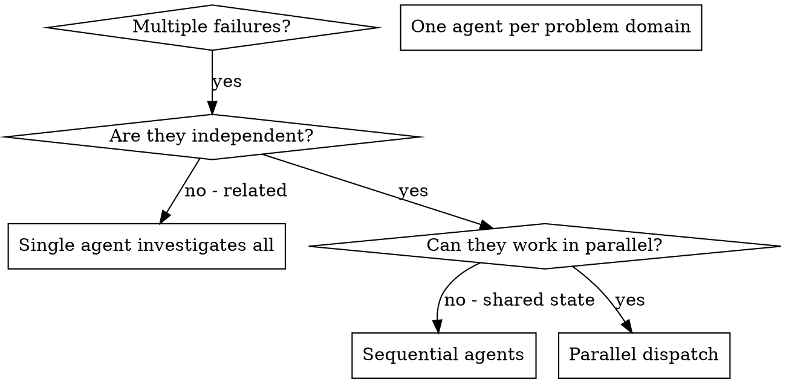

# 派发并行子代理（Dispatching Parallel Agents）

## 概述

你把任务委派给拥有隔离上下文的专用子代理。通过精心构造它们的指令与上下文，你确保它们保持专注并成功完成任务。它们绝不应继承你当前会话的上下文或历史——你为它们构造恰好所需的内容。这也能为你自己保留用于协调工作的上下文。

当你面对多个互不相关的失败（不同的测试文件、不同的子系统、不同的 bug）时，逐个顺序排查会浪费时间。每项排查都是独立的，完全可以并行进行。

**核心原则：** 每个独立的问题域派发一个子代理，让它们并发工作。

## 何时使用



**适用场景：**
- 3+ 个测试文件因不同的根本原因失败
- 多个子系统被独立地破坏
- 每个问题无需参考其他问题的上下文即可理解
- 各次排查之间没有共享状态

**不适用场景：**
- 失败彼此相关（修一个可能连带修好其他）
- 需要理解完整的系统状态
- 子代理之间会相互干扰

## 模式（The Pattern）

### 1. 识别独立领域

按"坏在哪里"对失败分组：
- 文件 A 的测试：工具（tool）批准流程
- 文件 B 的测试：批量完成（batch completion）行为
- 文件 C 的测试：中止（abort）功能

每个领域都是独立的——修复工具批准不会影响中止测试。

### 2. 创建聚焦的子代理任务

每个子代理获得：
- **明确的范围：** 一个测试文件或一个子系统
- **清晰的目标：** 让这些测试通过
- **约束：** 不要改动其他代码
- **期望的输出：** 一份"你发现了什么、修复了什么"的总结

### 3. 并行派发

在同一条响应中发出全部三个子代理派发——它们并行运行：

```text
Subagent (general-purpose): "Fix agent-tool-abort.test.ts failures"
Subagent (general-purpose): "Fix batch-completion-behavior.test.ts failures"
Subagent (general-purpose): "Fix tool-approval-race-conditions.test.ts failures"
# All three run concurrently.
```

一条响应里的多次派发调用 = 并行执行。一次只有一条 = 顺序执行。

### 4. 审查与整合

当子代理返回时：
- 阅读每份总结
- 验证各修复之间没有冲突
- 运行完整测试套件
- 整合所有改动

## 子代理提示词的结构（Agent Prompt Structure）

好的子代理提示词具备：
1. **聚焦（Focused）** - 单一清晰的问题域
2. **自包含（Self-contained）** - 包含理解问题所需的全部上下文
3. **明确指定输出（Specific about output）** - 子代理应当返回什么？

```markdown
修复 src/agents/agent-tool-abort.test.ts 中失败的 3 个测试：

1. "should abort tool with partial output capture" - 期望消息中出现 'interrupted at'
2. "should handle mixed completed and aborted tools" - 快速工具被中止而不是完成
3. "should properly track pendingToolCount" - 期望 3 个结果，却得到 0

这些都是时序/竞态问题。你的任务：

1. 阅读测试文件，理解每个测试在验证什么
2. 找出根本原因——是时序问题还是真实 bug？
3. 通过以下方式修复：
   - 用基于事件的等待取代随意设置的超时
   - 如果在中止实现中发现了 bug，就修复它
   - 如果被测行为已经改变，则调整测试期望

不要只是调大超时——找出真正的问题。

返回：一份"你发现了什么、修复了什么"的总结。
```

## 常见错误（Common Mistakes）

**❌ 太宽泛：** "修复所有测试" - 子代理会迷失方向
**✅ 具体：** "修复 agent-tool-abort.test.ts" - 范围聚焦

**❌ 没有上下文：** "修复这个竞态条件" - 子代理不知道问题在哪
**✅ 提供上下文：** 粘贴错误信息和测试名

**❌ 没有约束：** 子代理可能把一切都重构一遍
**✅ 给出约束：** "不要改动生产代码" 或 "只修测试"

**❌ 输出含糊：** "修好它" - 你无从得知改了什么
**✅ 输出具体：** "返回根本原因与改动的总结"

## 何时不要用（When NOT to Use）

**相关失败：** 修一个可能连带修好其他——先放在一起排查
**需要完整上下文：** 要理解问题就必须看到整个系统
**探索式调试：** 你还不清楚坏在哪
**共享状态：** 子代理会互相干扰（编辑同一批文件、使用同一批资源）

## 会话中的真实示例（Real Example from Session）

**场景：** 一次大型重构后，3 个文件共出现 6 个测试失败

**失败：**
- agent-tool-abort.test.ts：3 个失败（时序问题）
- batch-completion-behavior.test.ts：2 个失败（工具未执行）
- tool-approval-race-conditions.test.ts：1 个失败（执行计数 = 0）

**决策：** 相互独立的领域——中止逻辑独立于批量完成，也独立于竞态条件

**派发：**
```
Agent 1 → Fix agent-tool-abort.test.ts
Agent 2 → Fix batch-completion-behavior.test.ts
Agent 3 → Fix tool-approval-race-conditions.test.ts
```

**结果：**
- 子代理 1：用基于事件的等待取代了超时
- 子代理 2：修复了事件结构 bug（threadId 放错了位置）
- 子代理 3：增加了对异步工具执行完成的等待

**整合：** 所有修复彼此独立、无冲突，完整套件全绿

## 验证（Verification）

子代理返回之后：
1. **审阅每份总结** - 了解改了什么
2. **检查冲突** - 子代理是否编辑了同一份代码？
3. **运行完整套件** - 验证所有修复能协同工作
4. **抽查** - 子代理可能会犯系统性错误
