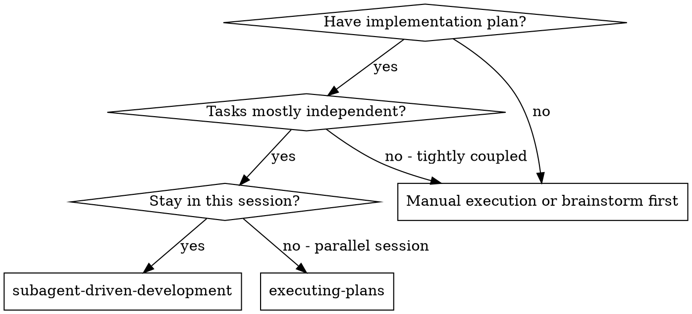
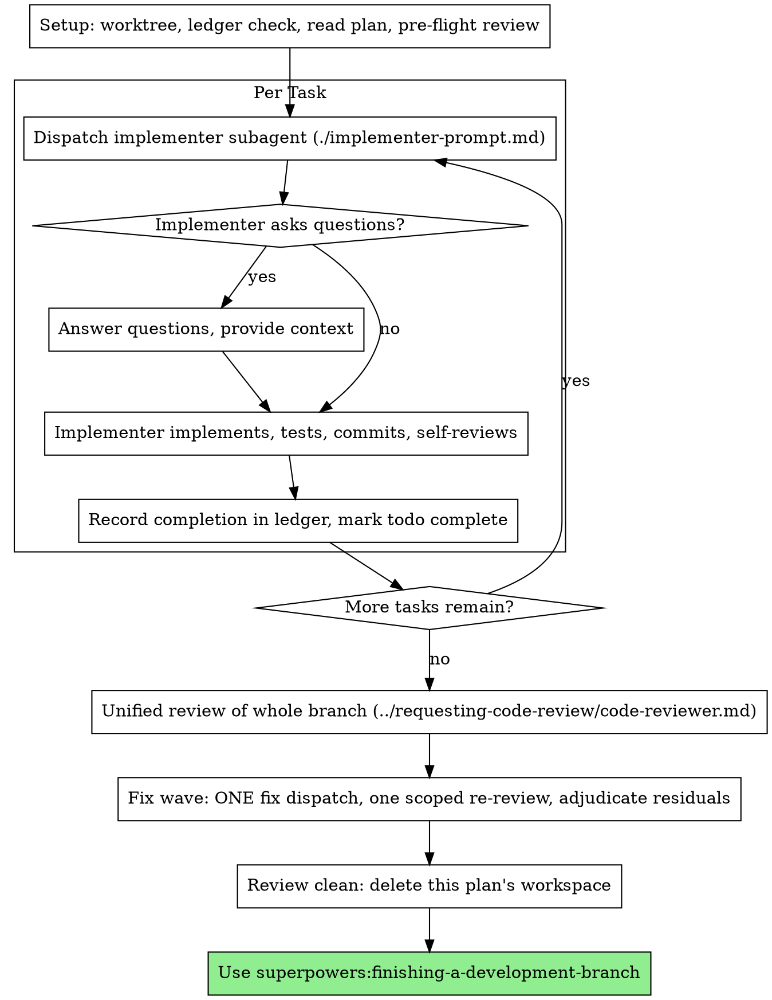

# 子代理驱动开发（Subagent-Driven Development）

执行计划的方式是：每个任务派发一个全新的实现子代理，由实现者实现、测试、提交并自审；**所有任务执行完成之后**，才对整条分支做一次统一的整体审查（规格符合性 + 代码质量）并修复其发现。

**为什么用子代理：** 你把任务委派给拥有隔离上下文的专用子代理。通过精心构造它们的指令与上下文，你确保它们保持专注并成功完成任务。它们绝不应继承你当前会话的上下文或历史——你为它们构造恰好所需的内容。这也能为你自己保留用于协调工作的上下文。

**核心原则：** 每个任务一个全新子代理 + 实现者自审 + 所有任务完成后统一审查 = 高质量、快速迭代

**旁白（Narration）：** 在两次工具调用之间，最多旁白一行短话——台账（ledger）和工具结果自会承载记录。

**持续执行：** 不要在任务之间停下来向你的（人类）搭档确认。一口气执行完计划里的所有任务。唯一能让你停下来的理由，是下面点名的四类情况，或所有任务都已完成。"我该继续吗？"式的追问和进度汇报浪费他们的时间——他们让你执行计划，那就执行。

**裁决，而不是卡壳（Rulings, not stalls）。** 一份进行中的计划不会等人。冲突、歧义、计划缺陷、你本想请求突破的上限——都由你来裁决。规格说明是约束性权威，计划是它的论证，而两者都没回答的问题由你的判断来定夺。把每个决定记入台账，格式为 `Ruling: <你决定什么> — <为什么> — <如果错了代价是什么>`，然后继续前进。一次错误的裁决代价是返工，你的搭档看得见、也能撤销；而一个停在问题上的会话会浪费他们一整天，什么也换不来。

能让你停下来的只有四类事：不可逆或破坏性操作；涉及安全的动作；本 worktree 之外、按惯例应先征询的副作用（一次合并、推送到共享分支、一次发布）；以及一份破到"任何前进方向都只能靠猜"的计划。遇到这些，停下来问。

## 何时使用



**对比 执行计划（Executing Plans，并行会话）：**
- 同一会话（无上下文切换）
- 每个任务全新子代理（无上下文污染）
- 所有任务执行完成后再做一次统一的整体审查（规格符合性 + 代码质量）
- 迭代更快（任务之间无审查、无人工介入）

## 流程（The Process）



## 准备工作（Setup）

确保工作在隔离的工作区中发生：使用 superpowers:using-git-worktrees 创建一个，或核实已存在的那一个。未经你的（人类）搭档明确同意，绝不要在 main/master 分支上开始实施。

会话记忆无法在压缩（compaction）后幸存。在真实会话中，丢失了自己位置的控制器曾把整段已完成的任务序列重新派发了一遍——这是观察到的最昂贵的一次失败。请把进度记在台账（ledger）文件里，而不只是写在 todo 里。

- 每份计划独占一个工作区：技能启动时，运行本技能目录下的 `scripts/sdd-workspace PLAN_FILE`——它会打印该计划对应的 git 忽略目录（`<repo-root>/.superpowers/sdd/<plan-basename>/`），那里存放本计划的所有产物：台账、任务简报、报告、审查包。其他计划的目录永远不是你有权读写的地方。
- 检查本计划的台账是否在 `<workspace>/progress.md`。如果它的第一行指向你的计划文件，那么带 `Task <N>: complete，Task Begin Time <beginTime minutes>， Task End Time <endtime minutes>，Used Time <usedtime minutes>` 行的任务都已完成——不要重新派发它们；从第一个没有该标记的任务继续。最后一行是修复波的记录，说明计划正停在统一审查的修复波中：从下一轮恢复。第一行指向其他计划文件的台账——或遗留在旧的扁平路径 `.superpowers/sdd/progress.md` 的散落台账——属于其他计划的进度：让它留在原地，你自己从零开始。
- 以台账的身份标识作为第一行创建台账：`# SDD ledger — plan: <plan file path>`。
- 台账是你的恢复地图：其中点名的提交在 git 里真实存在，即使你的上下文已不记得创建过它们。压缩之后，相信台账和 `git log`，而不是你自己的记忆。
- `git clean -fdx` 会摧毁工作区（它是 git 忽略的临时区）；如果发生了，从 `git log` 恢复。

把计划通读一遍，记下它的上下文和全局约束，并为每个任务创建一个 todo。如果计划指名了一份规格说明（Spec），也把它读了：规格是计划据以论证的权威，计划内部的冲突以它为最终裁决。没有可达规格的计划要在台账里记一笔说明——缺少规格做出的裁决都是暂时性的。

在派发任务 1 之前，先通扫一遍计划找冲突，边查边记下你查了什么：

- 相互矛盾、或与计划"全局约束"冲突的任务
- 计划明确要求、但审查规则视为缺陷的东西（一个不断言任何东西的测试、一段逐字复制的逻辑块）

扫描的产物是一张表，而不是一份判决。每一个共享同一文件或同一接口的任务对占一行：两个任务各是谁、一方产出的对另一方消费的、你发现了什么。每个任务也占一行：它自身的文本是否自洽——它指定的测试对指定的代码、它创建的文件对它后来触碰的文件。"扫描是干净的"这句话如果没有这些行，就不算你做过扫描。

把表写进台账。在开始执行之前，对你发现的一切做出裁决——每条发现都对照强制产生它的计划文本——并把每条裁决记入台账。如果扫描是干净的，不解释直接继续。对它暴露出的每个冲突做出裁决——规格是约束性权威，计划是它的论证——把裁决记在对应行的旁边，然后派发任务 1。统一审查仍然是兜住"只有实施才会浮现的冲突"的网。

## 模型选择（Model Selection）

使用能胜任每个角色的、尽量低配的模型，以节约成本、提高速度。

**机械性实现任务**（孤立的函数、清晰的规格、1-2 个文件）：用快速且便宜的模型。当计划写得足够好时，大多数实现任务都是机械性的。

**集成与判断类任务**（多文件协调、模式匹配、调试）：用标准模型。

**架构与设计任务**：用当前可用能力最强的模型。统一的全分支审查就属于这一类——派发时要用当前可用能力最强的模型，而不是会话默认模型。

**统一审查与限定范围复审**：统一审查覆盖整条分支、常横跨多个任务的交互，用当前可用能力最强的模型；只验证修复 diff 的限定范围复审（scoped re-review）用便宜到中档的档次即可。

**修复波**：处理统一审查发现的修复子代理，用至少与实现者同级、通常更强的模型。

**派发子代理时始终显式指定模型。** 漏掉模型会让它继承你会话的模型——往往是最强也最贵的——这会悄悄毁掉本节的所有意图。

**轮数胜过 token 价格。** 墙上时钟与上下文成本随子代理消耗的轮数增长，而最便宜的模型在多步骤工作上通常要多花 2-3 倍的轮数——总成本反而更高。把中档模型作为审查者、以及从文字描述出发工作的实现者的下限。当任务的计划文本包含要写的完整代码时，实现就是"转写 + 测试"：这种实现者用最便宜的档即可。单文件机械修复也用最便宜的档。

**任务复杂度信号（实现任务）：**
- 只动 1-2 个文件且规格完整 → 便宜模型
- 动多个文件、有集成问题 → 标准模型
- 需要设计判断或对代码库的广泛理解 → 最强模型

## 任务循环（The Task Loop）

**批量处理同形状的小任务。** 当计划列出若干任务、而它们各自都是同一种小而独立的编辑——同一行修复、常量改动、或跨文件重复的字段添加——不要每个任务派发一个子代理。把列出每个文件及其改动的**一份**派发简报合并起来，把整批发给**一个**子代理。只有需要独立判断、独立测试或独立审查面的工作，才保留"一个任务一次派发"。批次的产物同样作为一批记录完成，统一审查时一并覆盖。

你贴进派发提示词的每一段内容——以及子代理打印回来的每一段——都会在你上下文里驻留到会话结束，并在之后的每一轮被重新读取。产物用文件来交接。

**等待已派发的子代理：** 永远不要用很短的超时去轮询等待接口，也不要陷入一次静默的无界等待。当你有本地工作可做时——更新台账、阅读报告、整理后续派发的材料——继续干活；子代理的结果会自己到达。当你确实空闲时，用有界的时长等待（在你的平台允许下，五到十分钟），每段之间发一行状态，并核对你的在途子代理：列出它们，追查任何已完成却没报告的对象。有界等待能在保留长等待绝大部分效率的同时，保证卡住或丢失的子代理在几分钟内被察觉，而不是等到会话结束。

### 1. 派发实现者

在派发前记录 BASE（`git rev-parse HEAD`）——台账里的任务提交范围（`<base7>..<head7>`）需要它。

- **任务简报（Task brief）：** 派发实现者之前，运行本技能的 `scripts/task-brief PLAN_FILE N`——它把任务全文抽取到唯一命名的文件并打印路径。派发内容要确保简报始终是需求的唯一来源。你的派发应包含：(1) 一行说明该任务在项目中的位置；(2) 简报路径，以"先读这个——它就是你的需求，其中含必须逐字使用的精确取值"引出；(3) 简报无从得知的、来自前序任务的接口与决策；(4) 你注意到的简报歧义的解决方案；(5) 报告文件路径与报告契约。精确取值（数字、魔法字符串、签名、测试用例）只出现在简报里。绝不让子代理通读整个计划文件。
- **报告文件（Report file）：** 让实现者的报告文件以简报命名（简报 `…/task-N-brief.md` → 报告 `…/task-N-report.md`），并把路径写进派发提示词。实现者把完整报告写进那里，返回时只报状态、提交、一行测试摘要和顾虑。
- 一份派发提示词描述**一个**任务，而不是会话的历史。不要把积累的前序任务摘要（"任务 1-3 之后的状态"）贴进后续派发——真实会话里曾有一次派发达到 42k 字符、其中 99% 是粘贴的历史。一个全新子代理需要的是：它的任务、它要触碰的接口、全局约束。仅此而已。
- 派发携带"不派子代理"契约（它在实现者模板里）：实现者绝不派发子代理——不派助手，更不派审查者。审查只能由你、在所有任务执行完成后进行。在真实会话中，实现者派生的每个审查者都只是重复了控制器本来就会做的统一审查——多出一整个审查席位。
- 如果前序任务的实现者自审时标记了会影响本任务的顾虑（已记入台账），在派发里带上那条记录的指针。
- 从派发结果里记录实现者的 agent 身份——统一审查后的修复波要恢复它。
- 绝不同时并行派发多个实现子代理（会冲突）。

模板：[implementer-prompt.md](implementer-prompt.md)

### 2. 处理报告

实现者子代理会报告四种状态之一。请分别恰当地处理：

**DONE：** 把完成行追加到台账（`Task <N>: complete (commits <base7>..<head7>, self-review clean)`），把 todo 标记为完成，然后继续下一个任务。**不要在任务之间派发任何审查者**——统一审查只发生在所有任务执行完成之后（见 3. 审查任务）。`<base7>` 是你在派发实现者前记录的提交——绝不要用 `HEAD~1`，它会悄悄丢掉多提交任务除最后一笔外的所有提交。

**DONE_WITH_CONCERNS：** 实现者完成了工作并自审，但标注了疑虑。继续之前先读这些顾虑。如果顾虑涉及正确性、或会让后续任务建立在不可靠的基础上——先处理它：做出裁决并（必要时）派同一实现者做一次小修复，把修复与裁决追加到台账，再继续。如果只是观察或风格层面的东西（例如"这个文件在变大"），记入台账作为延后项，继续下一个任务；统一审查会看到它们。

**NEEDS_CONTEXT：** 实现者需要之前没提供的信息。补上缺失的上下文后重新派发。

**BLOCKED：** 实现者无法完成任务。评估阻塞原因：
1. 如果是上下文问题，提供更多上下文，用同一模型重新派发
2. 如果任务需要更多推理，用更强的模型重新派发
3. 如果任务太大，把它拆成更小的块
4. 如果计划本身错了，对修正做出裁决、记入台账，并在派发中带上该裁决重新派发

**绝不要**无视一次升级、或强迫同一个模型在毫无改变的情况下重试。如果实现者说它卡住了，就必须有东西要改变。

如果实现者问问题——开工前或中途——清晰完整地回答，必要时补充上下文，并且不要催它进入实现。

### 3. 审查任务（统一审查：所有任务执行完成之后）

任务清单全部执行完成之前，不进行任何审查。统一审查只有一次，对象是整条分支——在最后一个任务记录完成、不再有剩余任务之后立刻派发。任务之间不派发审查者：中途审查会打断执行、烧掉协调上下文，而且尚未落定的代码会让结论很快过时。任务之间那一层把关由实现者的自审承担（报告里必须带测试证据）——但自审永远不能替代统一审查。

- **把整条分支的 diff 交给审查者：** 从本技能目录运行 `scripts/review-package PLAN_FILE MERGE_BASE HEAD`（MERGE_BASE = 分支起始的提交，例如 `git merge-base main HEAD`），把打印出的唯一文件路径传给审查者（无 bash 时：把 `git log --oneline`、`git diff --stat` 和分支范围的 `git diff -U10` 重定向到一个唯一命名的文件）。输出绝不进入你自己的上下文，审查者一次 Read 调用就能看到提交列表、stat 摘要和带上下文的完整 diff。绝不要在没有 diff 文件的情况下派发统一审查者。
- **审查者输入：** 用当前可用能力最强的模型派发（见"模型选择"），模板用 superpowers:requesting-code-review 的 [code-reviewer.md](../requesting-code-review/code-reviewer.md)。把计划文件（或规格）与台账指给审查者——台账里的裁决行、延后 minor、自审顾虑——让它对照计划逐项核实全部任务的功能与质量，并分诊哪些发现必须在合并前修掉。
- 不要要求审查者重跑实现者已经在同一份代码上跑过的测试——各任务的报告里带有测试证据。
- 不要替审查者预判发现——绝不要指示审查者忽略或不标记某个具体问题。如果你认为某条发现会是误报，就让审查者提出它，再由你在修复波里裁决。如果你正在写的提示词里出现了"不要标记"、"别把 X 当缺陷"、"最多 Minor"或"计划选择了"——停下来：你正在预判，通常是为了给自己省一次复审。
- 审查者可能报告"⚠️ 无法从 diff 验证（Cannot verify from diff）"的项——那些落在横跨多个任务交互的需求上。这些不阻塞审查，但你必须在放行前亲自逐条解决：计划与跨任务上下文在你手里，而审查者没有。如果你确认某项是真实缺口，就按失败的规格审查对待——它和其他发现一起进入修复波。

### 4. 修复波

当统一审查报告规格 ❌、任何 Critical 或 Important 级别的发现、或一条你确认为真实缺口的 ⚠️ 项时，修复波被触发。

修复波开始前，有两条路可以立刻离开它：

- 把 Minor 级别的发现随手记入进度台账（`Review: minor (deferred): <one-liner>`）。这些清单随收尾一起抵达你的（人类）搭档，供其分诊哪些必须在合并前修掉。一份没人读的汇总就是静默丢弃。Minor 发现绝不进入修复波。
- 一条被标注为"计划强制要求"的发现——或任何与计划文本要求冲突的发现——由你来裁决：把发现与计划文本放到天平上，以规格作为约束性权威做决定，并在行动之前把裁决记入台账。不要因为"计划就是这么写的"就打发掉发现，也不要在没有记录裁决的情况下派发与计划相抵触的修复。

其余一切进入修复波——整条分支恰好一轮：

1. 派发**一个**修复子代理携带完整发现清单——而不是每条发现一个修复者。逐条派修复者会让每个都重建上下文、重跑套件；一次真实会话的修复波成本，可能超过其所有任务之和。优先恢复对应的原实现者（它的上下文完好）；你的工具若无法给在途子代理再发消息，就派发一个携带台账、报告文件路径和发现清单的更强模型实现者。给它这样一段框架："统一审查在整条分支上发现了这些；请阅读台账与报告文件了解上下文。"
2. 实现者修复所有未决发现、为被改代码补上覆盖测试、把修复提交追加到分支。在重新派发复审者之前，确认修复报告里包含覆盖测试、运行过的命令和输出；三者齐备后再派发复审。在修复消息中点名覆盖测试文件——一行修复不需要跑整个套件。
3. 对修复波恰好做一次限定范围复审：运行 `scripts/review-package PLAN_FILE FIX_BASE HEAD`，其中 FIX_BASE 是统一审查看到的 head，并把 [re-review-prompt.md](re-review-prompt.md) 连同发现清单和打印出的 diff 路径一起派发。复审者对每条发现给出"已解决（ADDRESSED）"或"未解决（NOT ADDRESSED）"的裁定，并且只标记修复 diff 中新增的破坏。修复 diff 里新增的 Critical/Important 破坏加入未决发现。范围外的观察记入台账作为延后的 minor——它们永远不会延长修复波。

修复波之后，向台账追加：`Review: fix wave (<X> addressed, <Y> open — <finding one-liners>; commits <a7>..<b7>)`

永远不要在控制器会话里亲手修复发现——你的上下文要留给协调保持干净，而且控制器亲手修复会跳过审查。

**熔断器（The breaker）。** 当限定范围复审仍有未决发现时，停止派发修复。由你亲自逐条裁决每条未决发现——计划与跨任务上下文在你手里，而审查者没有：

- **审查者错了，或观点本身有争议：** 停放它——`Review: parked — <finding> — Ruling: <why the code stands>`。
- **是真的，但合并前不承重：** 用同样的方式停放，裁决里写明"它是真的，延后处理"。
- **是真的且承重（load-bearing）**——会破坏合并后的主分支，或暴露了计划缺陷：对"解除阻塞的最小改动"做出裁决，记入台账为 `Review: Ruling: <finding> — <what you decided and why>`，并把这条残项带进收尾，让它通过 finishing-a-development-branch 呈现给你的（人类）搭档。

只在修复波之后裁决。为了少跑一次复审而提前裁决，就是换了个名字的预判。每一次裁决都是一条台账记录——静默丢弃是被禁止的。**没有第二轮修复波。**

### 5. 完成任务

当统一审查干净返回——或残余未决发现都已带裁决处理——向台账追加整份计划的完成行，和你的其他记账放在同一条消息里：

- `Plan: complete (commits <merge-base7>..<head7>, unified review clean)`
- 裁决后：`Plan: complete (commits <merge-base7>..<head7>, <K> parked, <M> ruled)`

然后把所有 todo 标记为完成。至此计划执行与统一审查全部结束，进入下面的"收尾"。

## 收尾（Finish）

在你删除任何东西之前，把台账里所有含 `Ruling:` 的行收集起来——预检裁决、停放发现、熔断器裁定，全部——按你做出的先后顺序，放进你最后一条消息里"我做出的裁决（Rulings I made）"标题之下，每一条都带上"如果错了代价是什么"。清单必须是穷尽的：只要台账里有一条裁决，清单里就得有它。这份清单是你替（人类）搭档做的决定抵达他们的唯一途径——他们读它，然后返工任何你做错的部分。一条随工作区一起死掉的裁决，就是一次秘密做出的决定。

当统一审查干净、其修复（若有）已合并后，删除本计划的工作区（`rm -rf <workspace>`）——从此 git 历史就是记录。同级目录属于其他计划；别碰它们。

使用 superpowers:finishing-a-development-branch。

## 常见合理化借口（Common Rationalizations）

| 借口 | 现实 |
|------|------|
| "规格符合性差不多就行" | 统一审查发现了规格缺口 = 没做完。修复，或裁决——只有这两条出路。 |
| "我自己修吧，派发太折腾" | 控制器亲手修复会污染你的上下文并跳过审查。恢复实现者。 |
| "每个任务完成都停下来审查一遍更保险" | 中途审查打断执行、烧掉协调上下文，而尚未落定的代码会让结论很快过时；真正的把关在任务全部完成后的统一审查。 |
| "再来一轮修复就会收敛" | 越过修复波之后，轮次不会收敛——失败是结构性的。裁决并分流。 |
| "统一审查反正又会找到新问题" | 限定范围复审只验证修复；它不能跑题。未改动代码上的新发现进台账，不进修复波。 |
| "这条发现明显是错的，我扔了它" | 你只在裁决时处置发现，而每次处置都是一条台账记录。静默丢弃被禁止。 |
| "修复很小，跳过复审" | 未经复审的修复就是回归（regression）落地的方式。每一次修复都以一次限定范围复审收尾。 |
| "统一审查拖慢交付" | 没有审查的交付只是未经验证的瞎折腾。统一审查是合并前唯一的关卡。 |
| "台账记账是开销" | 台账是能在压缩中幸存的东西。没有台账的控制器曾把整段已完成任务序列重新派发了一遍。 |
| "实现者自己派了个审查者——免费的额外保障" | 那是审查同一份 diff 的重复席位；统一审查才是关卡。工作者自派审查者是需要标记的缺陷，不是严谨。 |

## 示例工作流（Example Workflow）

```
你：我正在用 Subagent-Driven Development（子代理驱动开发）执行这份计划。

[准备：worktree 已核实]
[通读计划文件一次：docs/superpowers/plans/feature-plan.md]
[解析工作区：scripts/sdd-workspace docs/superpowers/plans/feature-plan.md — 里面没有台账，全新开始]
[为所有任务创建 todos]

任务 1：钩子安装脚本

[为任务 1 运行 task-brief；携带简报 + 报告路径 + 上下文派发实现者]

实现者："开始之前——钩子应该装在用户级还是系统级？"

你："用户级（~/.config/superpowers/hooks/）"

实现者：[稍后]
  - 实现了 install-hook 命令
  - 添加了测试，5/5 通过
  - 自审：发现漏了 --force 标志，已补上
  - 已提交

[台账：Task 1: complete (commits a1b2c3d..d4e5f6a, self-review clean)]
[todo：任务 1 已完成]

任务 2：恢复模式（Recovery modes）

[为任务 2 运行 task-brief；携带简报 + 报告路径 + 上下文派发实现者]

实现者：[没有阻塞]
  - 添加了 verify/repair 模式
  - 8/8 测试通过
  - 已提交

[台账：Task 2: complete (commits d4e5f6a..e8f9a0b, self-review clean)]
[todo：任务 2 已完成]

... （任务 3、4 同此模式：实现 → 测试 → 自审 → 记入台账。任务之间不做审查。）

[所有任务都已执行完成，最后一个 todo 已完成]
[运行 review-package PLAN_FILE MERGE_BASE HEAD；用最强的模型派发统一审查者]
统一审查者：任务 2 缺进度报告（规格要求"每 100 项报告一次"）。
  问题（Important）：魔法数字（100）。其余需求全部满足。
  评估：需要修复（With fixes）。

[台账：Review: findings — task 2 缺进度报告（spec）; 魔法数字（src/recovery.js:7）]

[修复波：派发一个修复子代理携带全部发现]
修复者：添加了进度报告，抽出了 PROGRESS_INTERVAL 常量。
  重跑了 test/recovery.test.js —— 10/10 通过。

[运行 review-package PLAN_FILE FIX_BASE HEAD；派发限定范围复审]
复审者：缺进度报告 —— 已解决（ADDRESSED）（src/recovery.js:41）。
  魔法数字 —— 已解决（ADDRESSED）（src/recovery.js:7）。新增破坏：无。

[台账：Review: fix wave (2 addressed, 0 open; commits e8f9a0b..f3e4d5c6)]
[台账：Plan: complete (commits a1b2c3d..f3e4d5c6, unified review clean)]

[把台账里的 Ruling 行整理成"我做出的裁决（Rulings I made）"列给搭档]
[删除本计划的工作区 —— 记录从此活在 git 里]

完成！使用 superpowers:finishing-a-development-branch。
```
