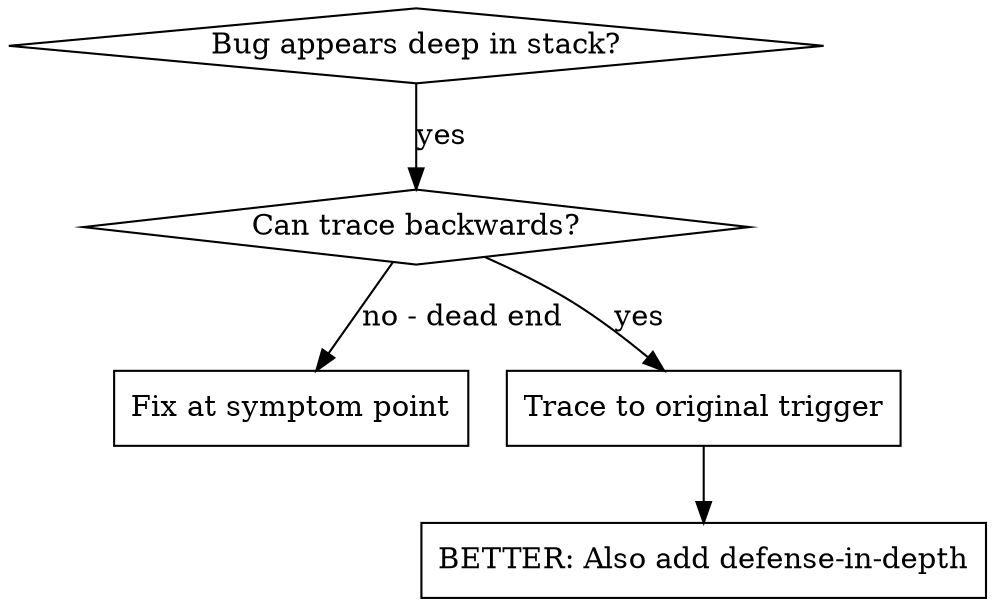
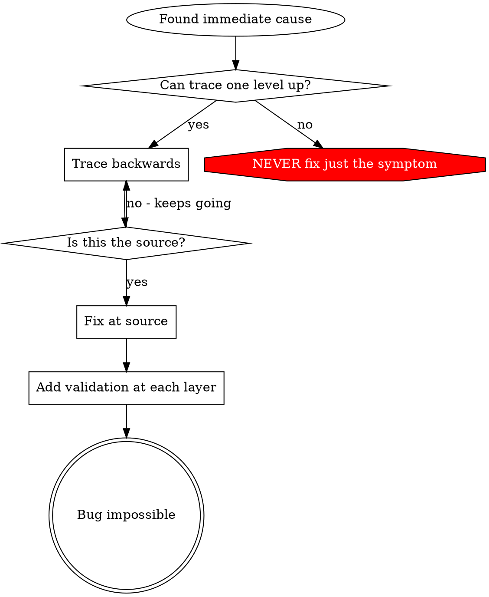

# 根因追踪（Root Cause Tracing）

## 概述（Overview）

Bug 常常在调用栈深处显现（在错误的目录里执行 `git init`、文件被创建到错误的位置、数据库打开了错误的路径）。你的本能是在错误出现的地方修复，但那是在治标。

**核心原则：** 沿着调用链向后追踪，直到找到最初的触发点，然后在源头修复。

## 何时使用（When to Use）



**出现以下情况时使用：**
- 错误发生在执行深处（不在入口点）
- 堆栈追踪显示出很长的调用链
- 不清楚无效数据源自哪里
- 需要找出是哪个测试 / 代码触发了问题

## 追踪流程（The Tracing Process）

### 1. 观察症状
```
Error: git init failed in ~/project/packages/core
```

### 2. 找出直接原因
**是哪段代码直接导致了这个？**
```typescript
await execFileAsync('git', ['init'], { cwd: projectDir });
```

### 3. 追问：谁调用了它？
```typescript
WorktreeManager.createSessionWorktree(projectDir, sessionId)
  → called by Session.initializeWorkspace()
  → called by Session.create()
  → called by test at Project.create()
```

### 4. 继续向上追踪
**传进来的是什么值？**
- `projectDir = ''`（空字符串！）
- 空字符串作为 `cwd` 会解析为 `process.cwd()`
- 那正是源代码目录！

### 5. 找到最初的触发点
**空字符串是从哪来的？**
```typescript
const context = setupCoreTest(); // Returns { tempDir: '' }
Project.create('name', context.tempDir); // Accessed before beforeEach!
```

## 添加堆栈追踪（Adding Stack Traces）

当你无法手动追踪时，加上插桩：

```typescript
// Before the problematic operation
async function gitInit(directory: string) {
  const stack = new Error().stack;
  console.error('DEBUG git init:', {
    directory,
    cwd: process.cwd(),
    nodeEnv: process.env.NODE_ENV,
    stack,
  });

  await execFileAsync('git', ['init'], { cwd: directory });
}
```

**关键：** 在测试里用 `console.error()`（别用 logger——它可能不显示）

**运行并捕获：**
```bash
npm test 2>&1 | grep 'DEBUG git init'
```

**分析堆栈追踪：**
- 找测试文件名
- 找到触发该调用的行号
- 识别模式（同一个测试？同一个参数？）

## 找出是哪个测试造成的污染（Finding Which Test Causes Pollution）

如果测试期间出现了什么东西，但你不知道是哪个测试：

使用本目录下的二分脚本 `find-polluter.sh`：

```bash
./find-polluter.sh '.git' 'src/**/*.test.ts'
```

它会逐个运行测试，在第一个污染者处停下。用法见脚本。

## 真实示例：空的 projectDir（Real Example: Empty projectDir）

**症状：** `.git` 被创建在了 `packages/core/`（源代码）里

**追踪链：**
1. `git init` 运行在 `process.cwd()` 里 ← 空的 cwd 参数
2. WorktreeManager 收到了空的 projectDir
3. Session.create() 传入了空字符串
4. 测试在 beforeEach 之前就访问了 `context.tempDir`
5. setupCoreTest() 初始返回 `{ tempDir: '' }`

**根因：** 顶层变量的初始化在空值被填入之前就访问了它

**修复：** 把 tempDir 改成 getter，若在 beforeEach 之前被访问则抛出异常

**还加了纵深防御（defense-in-depth）：**
- 第 1 层：Project.create() 校验目录
- 第 2 层：WorkspaceManager 校验不为空
- 第 3 层：NODE_ENV 守卫拒绝在 tmpdir 之外执行 git init
- 第 4 层：git init 之前的堆栈追踪日志

## 关键原则（Key Principle）



**绝不要只修错误出现的地方。** 向后追踪，找到最初的触发点。

## 堆栈追踪技巧（Stack Trace Tips）

**在测试里：** 用 `console.error()` 而不是 logger——logger 可能被抑制
**在操作之前：** 在危险操作之前记录日志，而不是等它失败之后
**包含上下文：** 目录、cwd、环境变量、时间戳
**捕获堆栈：** `new Error().stack` 会显示完整调用链

## 真实影响（Real-World Impact）

来自调试会话（2025-10-03）：
- 通过 5 层追踪找到根因
- 在源头修复（getter 校验）
- 加了 4 层防御
- 1847 个测试通过，零污染
