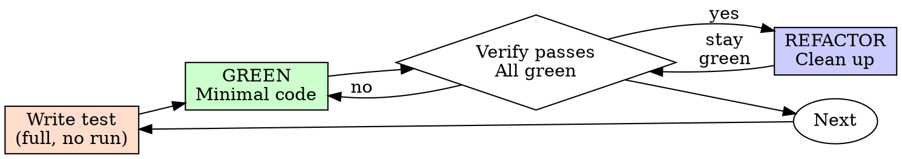

# 测试驱动开发（Test-Driven Development，TDD）

## 概述（Overview）

先写测试，一次写完整，不运行。再写让它通过的最小代码。运行测试集中在最后一步。

**核心原则：** 测试先行是先定下"应当发生什么"，再让实现去满足它；测试在实现写完之后才运行，用来同时确认实现和测试。

**违反规则的字面规定，就是违反规则的精神。**

## 何时使用（When to Use）

**始终：**
- 新特性
- Bug 修复
- 重构
- 行为变更

**例外（问你的搭档）：**
- 一次性原型
- 生成的代码
- 配置文件

心里想着"就这一次跳过 TDD"？停下来。那是在自我合理化。

## 铁律（The Iron Law）

```
没有先写好的测试，就不许写产品代码（NO PRODUCTION CODE WITHOUT A TEST WRITTEN FIRST）
```

在测试之前就写了代码？删掉它。重新开始。

**没有例外：**
- 不要把它留作"参考"
- 不要在写测试的同时"改编"它
- 不要再看它
- 删除就是删除

从测试出发重新实现。没有别的路。

## 测试-实现-验证：精简的 3 步循环

一次 TDD 迭代就是一轮 3 步循环（每步一次动作）：先写测试、再写实现，最后才运行。循环总览：



- **第 1 步：编写测试用例**
  把测试用例一次写完整——**写完不运行**，运行留给第 3 步。写一个最小测试，说明应当发生什么；测试须只测一个行为、命名清晰、测真实行为（除非无法避免，否则不用模拟）。好测试的规则见 [writing-good-tests.md](writing-good-tests.md)。

- **第 2 步：编写让测试通过的代码**
  写能让该测试通过的最小代码（GREEN）。不要添加超出测试范围的特性、不要重构其他代码、不要做超出测试的"改进"。

- **第 3 步：运行测试并确认它通过**
  这是本轮第一次运行测试。运行该测试与既有测试，确认：新测试通过、其他测试未被破坏、输出纯净无警告。
  - 测试失败？先分辨是实现没写对，还是测试本身写错了：实现的问题修实现，测试的问题修测试，但绝不放宽断言去迁就实现
  - 其他测试失败？现在就修

**通过之后（可选但通常要做）——REFACTOR 清理：** 消除重复、改进命名、抽取辅助函数。每步重构后回到第 3 步再跑一次，保持全绿，全程不引入新行为。

完成一轮后回到第 1 步：为下一个特性写下下一个测试用例，直到需求全部落地。完整走查示例见下文「示例：Bug 修复」。

## 好测试（Good Tests）

| 质量 | 好 | 坏 |
|---------|------|-----|
| **最小** | 一件事。名字里有"和"？拆开它。 | `test('validates email and domain and whitespace')` |
| **清晰** | 名称描述行为 | `test('test1')` |
| **展示意图** | 演示期望的 API | 掩盖了代码应当做什么 |

在编写或改动任何测试时，阅读 [writing-good-tests.md](writing-good-tests.md) 中保持测试诚实的那几条规则：
- 在写测试之前，先说出会让该测试失败的那个产品改动
- 断言真实行为，绝不断言模拟行为
- 把仅用于测试的代码留在测试工具里，别放进产品类
- 在模拟某个依赖之前，先理解它的副作用

## 常见的自我合理化

| 借口 | 现实 |
|--------|---------|
| "太简单了，不用测" | 简单的代码也会坏。测试只需 30 秒。 |
| "我之后会测" | 事后写的测试是从已经写出的实现倒推出来的——它们可能测错了东西、测了实现而不是行为、或漏掉了你忘记的那个边界情况。测试先行让"应当发生什么"在代码存在之前就被定下来，那时你还没被实现带偏。 |
| "事后测试能达到同样的目标（讲精神，不讲仪式）" | 事后测试回答"这代码做了什么？"；测试先行回答"这代码应当做什么？"事后写的测试会被你已经写出的代码带偏——你验证的是你记得的那些情况，而不是你会新发现的那些。 |
| "已经手动测过了" | 手动测试是即兴的：没有覆盖范围的记录，代码改动后无法重跑，压力下容易忘记用例。"我试的时候能用" ≠ 全面。自动化测试每次都以同样的方式运行。 |
| "删掉 X 小时的工作太浪费" | 沉没成本谬误——无论怎样那时间都已经花掉了。真正的选择是：用 TDD 重写（高置信度）vs 保留它并在事后硬挂测试（低置信度、可能藏 bug）。留着你无法信任的代码才是浪费。 |
| "留作参考，测试先行" | 你会去改编它。那还是事后测试。删除就是删除。 |
| "需要先探索" | 没问题。扔掉探索成果，用 TDD 重新开始。 |
| "测试难写 = 设计不清楚" | 要听测试的。难测 = 难用。 |
| "TDD 会拖慢我" | TDD 就是务实的路径：在提交前抓住 bug、防止回归、让你无惧重构。"务实"的捷径意味着在生产环境里调试——更慢，不是更快。 |
| "手动测试更快" | 手动证明不了边界情况。每次改动你都得重新测一遍。 |
| "既有代码没有测试" | 你正在改进它。为既有代码添加测试。 |

## 危险信号——停下来，重新开始（Red Flags - STOP and Start Over）

- 先写代码，后写测试
- 实现之后才写测试
- 说不清这个测试在验证什么行为
- 为了迁就实现而放宽断言、删断言
- 测试是"之后"补的
- 用"就这一次"自我合理化
- "我已经手动测过了"
- "事后测试能达到同样的目的"
- "这是讲精神，不是讲仪式"
- "留作参考"或"改编既有代码"
- "已经花了 X 小时，删掉太浪费"
- "TDD 太教条，我这是务实"
- "这次不一样，因为……"

**以上所有这些都意味着：删除代码。用 TDD 重新开始。**

## 示例：Bug 修复

**Bug：** 空的邮箱地址被接受

**第 1 步——测试用例（写完整，不运行）**
```typescript
test('rejects empty email', async () => {
  const result = await submitForm({ email: '' });
  expect(result.error).toBe('Email required');
});
```

**第 2 步——让测试通过的代码（GREEN）**
```typescript
function submitForm(data: FormData) {
  if (!data.email?.trim()) {
    return { error: 'Email required' };
  }
  // ...
}
```

**第 3 步——运行测试，确认通过**
```bash
$ npm test
PASS
```

**REFACTOR**
如果需要，为多个字段抽取校验逻辑。

## 验证清单（Verification Checklist）

在把工作标记为完成之前：

- [ ] 每个新函数/方法都有测试
- [ ] 测试在实现之前一次写完（第 1 步不运行）
- [ ] 第 3 步里的失败都分辨过：是实现缺失，还是测试写错
- [ ] 写了最小代码通过每个测试
- [ ] 所有测试都通过
- [ ] 输出纯净（没有错误、警告）
- [ ] 测试使用真实代码（只有在无法避免时才用模拟）
- [ ] 边界情况和错误被覆盖

有框打不了勾？你跳过了 TDD。重新开始。

## 卡住时（When Stuck）

| 问题 | 解决方案 |
|---------|----------|
| 不知道该怎么测 | 写出你想要的 API。先写断言。问你的搭档。 |
| 测试太复杂 | 设计太复杂。简化接口。 |
| 什么都得模拟 | 代码耦合太紧。用依赖注入。 |
| 测试设置太庞大 | 抽取辅助函数。还是很复杂？简化设计。 |

## 与调试的衔接（Debugging Integration）

发现 bug？先写一个复现它的测试（写完不运行），再写修复。遵循 TDD 循环。测试既证明修复，又防止回归。

绝不在没有测试的情况下修 bug。

## 最终规则（Final Rule）

```
产品代码 → 测试已存在，且先于代码写就
否则 → 这不是 TDD
```

未经你搭档的许可，没有例外。
