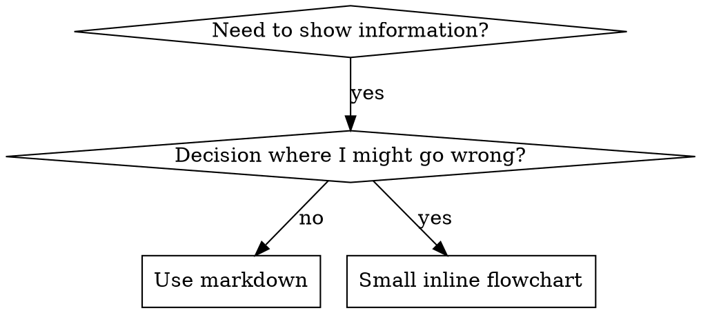

# 编写技能（Writing Skills）

## 概述（Overview）

**编写技能就是把测试驱动开发（TDD）应用于流程文档。**

**个人技能位于你运行时的技能目录中**（Claude Code 上是 `~/.claude/skills/`）——这些运行时上的路径见 [codex-tools.md](../using-superpowers/references/codex-tools.md) 或 [gemini-tools.md](../using-superpowers/references/gemini-tools.md)。Codex、Copilot CLI 和 Gemini CLI 也都把 `~/.agents/skills/` 识别为跨运行时别名。

你编写测试用例（与子代理一起的压力场景），看着它们失败（基线行为），编写技能（文档），看着测试通过（代理遵守），然后重构（堵上漏洞）。

**核心原则：** 如果你没看过一个代理在没有该技能时的失败，你就不知道这个技能是否教会了正确的东西。

**必备背景（REQUIRED BACKGROUND）：** 在使用本技能之前，你必须理解 superpowers:test-driven-development。那个技能定义了基本的 RED-GREEN-REFACTOR 循环。本技能把 TDD 改编应用于文档。

**官方指引：** Anthropic 官方的技能编写最佳实践见 anthropic-best-practices.md。本文档提供了额外模式与指南，作为本技能中以 TDD 为核心的方法的补充。

## 什么是技能？（What is a Skill?）

**技能**是关于成熟技术、模式或工具的参考指南。技能帮助未来的代理找到并应用有效的方法。

**技能是：** 可复用的技术、模式、工具、参考指南

**技能不是：** 关于你某一次如何解决某个问题的叙述故事

## 技能创作的 TDD 映射（TDD Mapping for Skills）

| TDD 概念 | 技能创作 |
|-------------|----------------|
| **测试用例** | 与子代理一起的压力场景 |
| **产品代码** | 技能文档（SKILL.md） |
| **测试失败（RED）** | 代理在没有技能时违反规则（基线） |
| **测试通过（GREEN）** | 代理在有技能时遵守规则 |
| **重构** | 在保持遵守的同时堵上漏洞 |
| **先写测试** | 在写技能之前运行基线场景 |
| **看着它失败** | 逐字记录代理使用的自我合理化话术 |
| **最小代码** | 编写只针对那些具体违规行为的技能 |
| **看着它通过** | 验证代理现在遵守规则 |
| **重构循环** | 发现新的合理化话术 → 堵漏 → 重新验证 |

整个技能创作过程遵循 RED-GREEN-REFACTOR。

## 何时创建技能（When to Create a Skill）

**出现以下情况时创建：**
- 某技术对你来说不是凭直觉就显而易见的
- 你会跨项目再次引用它
- 该模式广泛适用（不是项目特定的）
- 其他人会受益

**不要为以下情况创建：**
- 一次性解决方案
- 别处已有完善文档的常规做法
- 项目特定的约定（放进你的指令文件）
- 机械性的约束（如果可以用正则/校验强制，那就自动化它——把文档留给需要判断的场合）

## 技能类型（Skill Types）

### 技术（Technique）
有步骤可循的具体方法（condition-based-waiting、root-cause-tracing）

### 模式（Pattern）
看待问题的思维方式（flatten-with-flags、test-invariants）

### 参考（Reference）
API 文档、语法指南、工具文档（office 文档）

## 目录结构（Directory Structure）

```
skills/
  skill-name/
    SKILL.md              # 主参考文档（必需）
    supporting-file.*     # 仅在需要时
```

**扁平命名空间** - 所有技能都放在一个可搜索的命名空间里

**以下内容独立成文件：**
1. **重型参考（100+ 行）** - API 文档、完整语法
2. **可复用工具** - 脚本、实用程序、模板

**以下内容内联保留：**
- 原则与概念
- 代码模式（< 50 行）
- 其他所有内容

## SKILL.md 结构

**前置元数据（YAML）：**
- 两个必填字段：`name` 和 `description`（所有受支持的字段见 [agentskills.io/specification](https://agentskills.io/specification)）
- 总计最多 1024 个字符
- `name`：只用字母、数字和连字符（不要括号、特殊字符）
- `description`：第三人称，只描述何时使用（而不是它做什么）
  - 以"Use when..."（何时使用……时）开头，聚焦触发条件
  - 包含具体的症状、情境和上下文
  - **绝不要概括技能的过程或工作流**（原因见 SDO 一节）
  - 尽量控制在 500 字符以内

```markdown
---
name: Skill-Name-With-Hyphens
description: Use when [specific triggering conditions and symptoms]
---

# Skill Name

## Overview
这是什么？用 1-2 句给出核心原则。

## When to Use（何时使用）
[如果决策不显而易见，给一个小型内联流程图]

症状与用例的列表
何时不使用

## Core Pattern（核心模式，用于技术/模式类）
改动前后的代码对比

## Quick Reference（快速参考）
用于快速浏览常见操作的表格或列表

## Implementation（实现）
简单模式用内联代码
重型参考或可复用工具则链接到文件

## Common Mistakes（常见错误）
哪里会出问题 + 如何修复

## Real-World Impact（真实世界影响，可选）
具体成果
```

## 技能发现优化（SDO，Skill Discovery Optimization）

**对发现至关重要：** 未来的代理需要能找到你的技能

### 1. 丰富的描述字段

**目的：** 你的代理通过阅读 description 来决定某个任务要加载哪些技能。要让它能回答："我现在该读这个技能吗？"

**格式：** 以"Use when..."开头，聚焦触发条件

**关键（CRITICAL）：description = 何时使用，而不是技能做什么**

description 应当只描述触发条件。绝不要在 description 里概括技能的过程或工作流。

**为什么这很重要：** 测试揭示，当 description 概括了技能的工作流时，代理可能会照着 description 行事，而不是去读完整的技能内容。一条写着"任务之间做代码审查"的 description 曾让代理只做一次审查，尽管该技能的流程图清楚地显示了两次审查（规格符合性然后代码质量）。

当 description 被改成只是"在执行带独立任务的实施计划时使用"（没有工作流概括）时，代理正确地读了流程图并遵循了两阶段审查流程。

**陷阱：** 概括工作流的 description 会造成代理会抄的近道。技能正文变成了代理会跳过的文档。

```yaml
# ❌ 坏：概括了工作流——代理可能会照此行事而不是读技能
description: Use when executing plans - dispatches subagent per task with code review between tasks

# ❌ 坏：过程细节太多
description: Use for TDD - write test first, watch it fail, write minimal code, refactor

# ✅ 好：只有触发条件，没有工作流概括
description: Use when executing implementation plans with independent tasks in the current session

# ✅ 好：只有触发条件
description: Use when implementing any feature or bugfix, before writing implementation code
```

**内容：**
- 用具体的触发词、症状和情境来表明该技能何时适用
- 描述*问题*（竞态条件、不一致行为），而不是*语言特定的症状*（setTimeout、sleep）
- 除非技能本身是技术特定的，否则让触发条件与技术无关
- 如果技能是技术特定的，在触发条件里明确说明
- 用第三人称写（会被注入系统提示词）
- **绝不要概括技能的过程或工作流**

```yaml
# ❌ 坏：太抽象、含糊、没包含何时使用
description: For async testing

# ❌ 坏：第一人称
description: I can help you with async tests when they're flaky

# ❌ 坏：提到了技术，但技能并非针对它
description: Use when tests use setTimeout/sleep and are flaky

# ✅ 好：以"Use when"开头、描述问题、无工作流
description: Use when tests have race conditions, timing dependencies, or pass/fail inconsistently

# ✅ 好：技术特定的技能 + 明确的触发条件
description: Use when using React Router and handling authentication redirects
```

### 2. 关键词覆盖

用代理会搜索的词：
- 错误消息："Hook timed out"、"ENOTEMPTY"、"race condition"
- 症状："flaky"、"hanging"、"zombie"、"pollution"
- 同义词："timeout/hang/freeze"、"cleanup/teardown/afterEach"
- 工具：实际的命令、库名、文件类型

### 3. 描述性命名

**用主动语态，动词优先：**
- ✅ `creating-skills` 而不是 `skill-creation`
- ✅ `condition-based-waiting` 而不是 `async-test-helpers`

### 4. 令牌效率（关键）

**问题：** getting-started 和被频繁引用的技能会被加载进每一段对话。每一个令牌都很重要。

**目标字数：**
- getting-started 工作流：每个 < 150 词
- 频繁加载的技能：总计 < 200 词
- 其他技能：< 500 词（仍然要简洁）

**技巧：**

**把细节挪进工具帮助：**
```bash
# ❌ 坏：在 SKILL.md 里记录所有标志
search-conversations supports --text, --both, --after DATE, --before DATE, --limit N

# ✅ 好：引用 --help
search-conversations supports multiple modes and filters. Run --help for details.
```

**使用交叉引用：**
```markdown
# ❌ 坏：重复工作流细节
When searching, dispatch subagent with template...
[20 lines of repeated instructions]

# ✅ 好：引用其他技能
Always use subagents (50-100x context savings). REQUIRED: Use [other-skill-name] for workflow.
```

**压缩示例：**
```markdown
# ❌ 坏：冗长示例（42 词）
your human partner: "How did we handle authentication errors in React Router before?"
You: I'll search past conversations for React Router authentication patterns.
[Dispatch subagent with search query: "React Router authentication error handling 401"]

# ✅ 好：极简示例（20 词）
Partner: "How did we handle auth errors in React Router?"
You: Searching...
[Dispatch subagent → synthesis]
```

**消除冗余：**
- 不要重复交叉引用技能里已有的内容
- 不要解释命令中显而易见的东西
- 不要为同一模式放多个示例

**验证：**
```bash
wc -w skills/path/SKILL.md
# getting-started 工作流：目标 < 150 每个
# 其他频繁加载的：目标总计 < 200
```

**按你"做什么"或核心洞见来命名：**
- ✅ `condition-based-waiting` > `async-test-helpers`
- ✅ `using-skills` 而不是 `skill-usage`
- ✅ `flatten-with-flags` > `data-structure-refactoring`
- ✅ `root-cause-tracing` > `debugging-techniques`

**动名词（-ing）很适合流程：**
- `creating-skills`、`testing-skills`、`debugging-with-logs`
- 主动，描述你正在采取的行动

### 5. 交叉引用其他技能

**当写会引用其他技能的文档时：**

只用技能名，并带明确的必备标记：
- ✅ 好：`**REQUIRED SUB-SKILL:** Use superpowers:test-driven-development`
- ✅ 好：`**REQUIRED BACKGROUND:** You MUST understand superpowers:systematic-debugging`
- ❌ 坏：`See skills/testing/test-driven-development`（不清楚是否为必需）
- ❌ 坏：`@skills/testing/test-driven-development/SKILL.md`（强制加载，烧掉上下文）

**为什么不用 @ 链接：** `@` 语法会立即强制加载文件，在你需要它们之前就消耗掉 200k+ 上下文。

## 流程图的使用（Flowchart Usage）



**只在以下情况使用流程图：**
- 不显而易见的决策点
- 你可能会过早停下来的流程循环
- "何时用 A 而非 B"的决策

**绝不要用流程图呈现：**
- 参考材料 → 表格、列表
- 代码示例 → Markdown 块
- 线性指令 → 编号列表
- 无语义含义的标签（step1、helper2）

本目录下的 `graphviz-conventions.dot` 见 graphviz 风格规则。

**为你的搭档可视化：** 用本目录下的 `render-graphs.js` 把某个技能的流程图渲染成 SVG：
```bash
./render-graphs.js ../some-skill           # 每个图单独渲染
./render-graphs.js ../some-skill --combine # 所有图合并进一个 SVG
```

## 代码示例（Code Examples）

**一个优秀的示例胜过许多平庸的示例**

选择最相关的语言：
- 测试技术 → TypeScript/JavaScript
- 系统调试 → Shell/Python
- 数据处理 → Python

**好示例：**
- 完整且可运行
- 注释完善，解释为什么（WHY）
- 来自真实场景
- 清晰展示模式
- 准备好可改编（不是通用模板）

**不要：**
- 用 5+ 种语言实现
- 创建填空式模板
- 编写刻意造出来的示例

你擅长移植——一个好示例就够了。

## 文件组织（File Organization）

### 自包含技能（Self-Contained Skill）
```
defense-in-depth/
  SKILL.md    # 一切内联
```
适用场景：所有内容都放得下，不需要重型参考

### 带可复用工具的技能（Skill with Reusable Tool）
```
condition-based-waiting/
  SKILL.md    # 概述 + 模式
  example.ts  # 可改编的工作助手
```
适用场景：工具是可复用代码，而不只是叙述

### 带重型参考的技能（Skill with Heavy Reference）
```
pptx/
  SKILL.md       # 概述 + 工作流
  pptxgenjs.md   # 600 行 API 参考
  ooxml.md       # 500 行 XML 结构
  scripts/       # 可执行工具
```
适用场景：参考材料太大，无法内联

## 铁律（The Iron Law，与 TDD 相同）

```
没有先失败的测试，就没有技能（NO SKILL WITHOUT A FAILING TEST FIRST）
```

这适用于新技能和对既有技能的改动。

先写了技能再测试？删掉它。重新开始。
不测试就改技能？同样的违规。

**没有例外：**
- "简单加个东西"也不行
- "只是加一节"也不行
- "文档更新"也不行
- 不要把未经测试的改动当作"参考"保留
- 不要在跑测试的同时"顺手改编"
- 删除就是删除

**必备背景（REQUIRED BACKGROUND）：** superpowers:test-driven-development 技能解释了为什么这很重要。同样的原则也适用于文档。

## 测试所有技能类型（Testing All Skill Types）

不同的技能类型需要不同的测试方法：

### 纪律强制型技能（规则/要求）

**示例：** TDD、verification-before-completion、designing-before-coding

**用以下方式测试：**
- 学术性问题：他们理解规则吗？
- 压力场景：他们在压力下会遵守吗？
- 多重压力叠加：时间 + 沉没成本 + 疲惫
- 识别自我合理化话术并加上显式对策

**成功标准：** 代理在最大压力下仍遵循规则

### 技术型技能（操作指南）

**示例：** condition-based-waiting、root-cause-tracing、defensive-programming

**用以下方式测试：**
- 应用场景：他们能正确应用该技术吗？
- 变体场景：他们能处理边界情况吗？
- 信息缺失测试：指令有缺口吗？

**成功标准：** 代理能把该技术成功应用到新场景

### 模式型技能（心智模型）

**示例：** reducing-complexity、information-hiding 概念

**用以下方式测试：**
- 识别场景：他们能识别该模式何时适用吗？
- 应用场景：他们能使用这个心智模型吗？
- 反例：他们知道何时不该应用吗？

**成功标准：** 代理正确识别何时/如何应用该模式

### 参考型技能（文档/API）

**示例：** API 文档、命令参考、库指南

**用以下方式测试：**
- 检索场景：他们能找到正确的信息吗？
- 应用场景：他们能正确使用找到的内容吗？
- 缺口测试：常见用例被覆盖了吗？

**成功标准：** 代理找到并正确应用参考信息

## 跳过测试的常见自我合理化

| 借口 | 现实 |
|--------|---------|
| "技能显然很清楚" | 对你是清楚的 ≠ 对其他代理清楚。去测试它。 |
| "它只是个参考" | 参考也可能有缺口、含混的章节。测试检索。 |
| "测试是杀鸡用牛刀" | 未经测试的技能总有问题。永远。15 分钟测试能省几小时。 |
| "出了问题我再测" | 问题 = 代理用不了技能。要在部署之前测试。 |
| "测试太烦了" | 测试比在生产环境调试一个烂技能要省心得多。 |
| "我很确信它很好" | 过度自信保证出问题。还是要测。 |
| "学术性审阅就够了" | 读过 ≠ 用过。要测应用场景。 |
| "没时间测试" | 部署未经测试的技能，之后修复它浪费的时间更多。 |

**所有这些都意味着：部署之前先测试。没有例外。**

## 让形式匹配失败（Match the Form to the Failure）

在写指引之前，先对基线失败分类。能堵死某一种失败类型的形式，对另一种可测地适得其反。

| 基线失败 | 正确形式 | 错误形式 |
|---|---|---|
| 在压力下跳过/违反一条规则（明明知道，还是照做） | 禁令 + 合理化表格 + 危险信号（见下方"防弹加固"） | 软性指引（"最好……"、"考虑……"） |
| 遵守了，但输出形态不对（臃肿的提示词、埋没的结论、复述规格） | 正向配方或契约：陈述输出"是什么"——它的组成部分、按顺序 | 禁令清单（"不要复述"、"绝不叙述"） |
| 从他们已经产出的东西里漏掉某个必需元素 | 结构性的：在模板里设置 REQUIRED 字段或槽位 | 模板附近的散文提醒 |
| 行为应当取决于某个条件 | 绑定可观察谓词的条件（"如果简报存在，就引用它"） | 无条件规则 + 豁免条款 |

**为什么禁令在塑形问题上适得其反：** 在竞争性激励下（"让提示词自足"），代理会与"不要 X"讨价还价。在对派发提示词指引的逐词对照测试中，禁令分支比配方分支产出了明显更多的不想要内容（分布完全分离），甚至比"无指引对照组"还差——请为你的具体案例做微测试，而不是想当然，但永远不要默认使用禁令。配方没什么可讨价还价的：输出要么匹配所陈述的形态，要么不匹配。

**无论你选哪种形式，都要遵守的规则：**
- **没有细微微调条款。** "除非有关系，否则不要 X"会重新打开谈判——在同样的措辞测试中，给一个胜出的配方追加一条细微微调条款，就把它从稳定降级为嘈杂。要把真正的例外表达为一条绑定可观察谓词的独立条件。
- **豁免条款不能限定范围。** "此限制不适用于代码块"仍然会压制代码块。如果输出的某部分必须被豁免，那就重构结构，让规则够不到它。

## 让技能对自我合理化免疫（防弹加固，Bulletproofing Skills Against Rationalization）

强制纪律的技能（如 TDD）需要能抵抗自我合理化。代理很聪明，在压力下会找漏洞。

**适用范围：** 这套工具集针对纪律型失败——代理明知规则却在压力下跳过它。对于形态不对的输出或遗漏的元素，基于禁令的防弹加固会适得其反；改用"让形式匹配失败"中的形式。

**心理学备注：** 理解说服技巧为什么有效，能帮你系统地应用它们。研究基础见 persuasion-principles.md（Cialdini，2021；Meincke 等，2025），涉及权威、承诺、稀缺、社会认同和一致性（unity）原则。

### 显式堵死每一个漏洞

不要只陈述规则——要禁止具体的变通方式：

<Bad>
```markdown
Write code before test? Delete it.
```
</Bad>

<Good>
```markdown
Write code before test? Delete it. Start over.

**No exceptions:**
- Don't keep it as "reference"
- Don't "adapt" it while writing tests
- Don't look at it
- Delete means delete
```
</Good>

### 回应"精神 vs 字面"的争辩

尽早加入根本性原则：

```markdown
**Violating the letter of the rules is violating the spirit of the rules.**
```

这能斩断整类"我是在遵循精神"的自我合理化。

### 建立合理化表格

从基线测试（见下方"测试"一节）中捕捉自我合理化话术。代理说出的每个借口都放进表格：

```markdown
| Excuse | Reality |
|--------|---------|
| "Too simple to test" | Simple code breaks. Test takes 30 seconds. |
| "I'll test after" | Tests passing immediately prove nothing. |
| "Tests after achieve same goals" | Tests-after = "what does this do?" Tests-first = "what should this do?" |
```

### 创建危险信号清单

让代理在自我合理化时容易自查：

```markdown
## Red Flags - STOP and Start Over

- Code before test
- "I already manually tested it"
- "Tests after achieve the same purpose"
- "It's about spirit not ritual"
- "This is different because..."

**All of these mean: Delete code. Start over with TDD.**
```

### 针对违规症状更新 SDO

在 description 里加入：当你即将违反规则时的症状：

```yaml
description: use when implementing any feature or bugfix, before writing implementation code
```

## 技能的 RED-GREEN-REFACTOR

遵循 TDD 循环：

### RED：编写失败测试（基线）

在*没有*该技能的情况下对子代理运行压力场景。逐字记录实际行为：
- 他们做了哪些选择？
- 他们用了哪些自我合理化话术（逐字记录）？
- 哪些压力触发了违规？

这就是"看着测试失败"——在写技能之前，你必须看到代理们自然的行为。

### GREEN：编写最小技能

编写针对那些具体自我合理化话术的技能。不要为假设的情况添加额外内容。

*带着*该技能运行同样的场景。代理现在应当遵守。

### REFACTOR：堵上漏洞

代理找到了新的自我合理化话术？加上显式对策。重新测试，直到防弹。

### 在完整场景之前先微测试措辞

完整的压力场景运行是最终门禁，但每次迭代都又慢又贵。先用微测试验证措辞本身：

1. **每次调用一个全新上下文样本** —— 一次原始 API 调用，或在你没有 API 访问权限时的单发子代理。系统提示词 = 该指引将要栖身的现实上下文（完整的技能或提示词模板，而不是孤立的指引）；用户消息 = 一个会诱惑出那次失败的任务。
2. **始终包含一个无指引对照组。** 如果对照组没表现出失败，那就没有东西要修——停下，不要编写那条指引。
3. **每个变体 5+ 次重复。** 单一样本会说谎。
4. **人工阅读每一个被标记的匹配。** 如果你想，可以用程序打分，但模板回声和被引用的反例会冒充命中；仅靠自动计数会同时高估失败和成功。
5. **方差本身是一个指标。** 当指引落地时，多次重复会收敛到同一形态。五次重复出现五种不同解读，说明措辞没有约束力——先收紧形式，再增加文字。

微测试验证措辞；它们不能取代纪律型技能的压力场景。

**测试方法论：** 完整的方法论见 [testing-skills-with-subagents.md](testing-skills-with-subagents.md)：
- 如何编写压力场景
- 压力类型（时间、沉没成本、权威、疲惫）
- 系统性地堵洞
- 元测试技术

## 反模式（Anti-Patterns）

### ❌ 叙述性示例
"在 2025-10-03 的会话中，我们发现空的 projectDir 导致了……"
**为什么不好：** 太具体、不可复用

### ❌ 多语言稀释
example-js.js、example-py.py、example-go.go
**为什么不好：** 平庸的质量、维护负担

### ❌ 流程图里的代码
```dot
step1 [label="import fs"];
step2 [label="read file"];
```
**为什么不好：** 无法复制粘贴、难以阅读

### ❌ 通用标签
helper1、helper2、step3、pattern4
**为什么不好：** 标签应当有语义含义

## 停下来：在进入下一个技能之前（STOP: Before Moving to Next Skill）

**写任何一个技能之后，你必须停下来，完成部署流程。**

**不要：**
- 不逐个测试就批量创建多个技能
- 在当前的验证完之前就转到下一个技能
- 因为"批量更高效"就跳过测试

**下面的部署清单对每个技能都是强制性的。**

部署未经测试的技能 = 部署未经测试的代码。这是对质量标准的违背。

## 技能创建清单（改编自 TDD）

**重要：为下面清单的每一项创建一条 todo。**

**RED 阶段 - 编写失败测试：**
- [ ] 创建压力场景（纪律型技能要 3+ 种压力叠加）
- [ ] 在没有技能的情况下运行场景——逐字记录基线行为
- [ ] 识别自我合理化/失败中的模式

**GREEN 阶段 - 编写最小技能：**
- [ ] 名称只用字母、数字、连字符（没有括号/特殊字符）
- [ ] 带必需 `name` 和 `description` 字段的 YAML 前置元数据（最多 1024 字符；见 [规范](https://agentskills.io/specification)）
- [ ] description 以"Use when..."开头，包含具体触发词/症状
- [ ] description 用第三人称写
- [ ] 全文分布供搜索的关键词（错误、症状、工具）
- [ ] 带核心原则的清晰概述
- [ ] 针对 RED 阶段识别出的具体基线失败
- [ ] 指引形式匹配失败类型（见"让形式匹配失败"）
- [ ] 塑形行为的指引：措辞对照"无指引对照组"做过微测试（5+ 次重复，每个被标记的匹配都人工阅读）——纯参考型技能不适用
- [ ] 代码内联 或 链接到单独文件
- [ ] 一个优秀示例（不是多语言）
- [ ] 带着技能运行场景——验证代理现在遵守

**REFACTOR 阶段 - 堵上漏洞：**
- [ ] 从测试中识别新的自我合理化话术
- [ ] 加上显式对策（如果是纪律型技能）
- [ ] 从所有测试迭代中建立合理化表格
- [ ] 创建危险信号清单
- [ ] 重新测试，直到防弹

**质量检查：**
- [ ] 只有在决策不显而易见时才用小流程图
- [ ] 快速参考表格
- [ ] 常见错误章节
- [ ] 没有叙述性故事
- [ ] 支持文件只用于工具或重型参考

**部署：**
- [ ] 把技能提交到 git 并推送到你的 fork（如果已配置）
- [ ] 考虑通过 PR 回馈（如果广泛有用）

## 发现工作流（Discovery Workflow）

未来的代理如何找到你的技能：

1. **遇到问题**（"tests are flaky"）
2. **搜索技能**（grep 描述、浏览分类）
3. **找到 SKILL**（description 匹配）
4. **扫一眼概述**（这相关吗？）
5. **读模式**（快速参考表格）
6. **加载示例**（只有在实现时）

**针对这个流程做优化** - 让可搜索的词尽早、频繁地出现。
